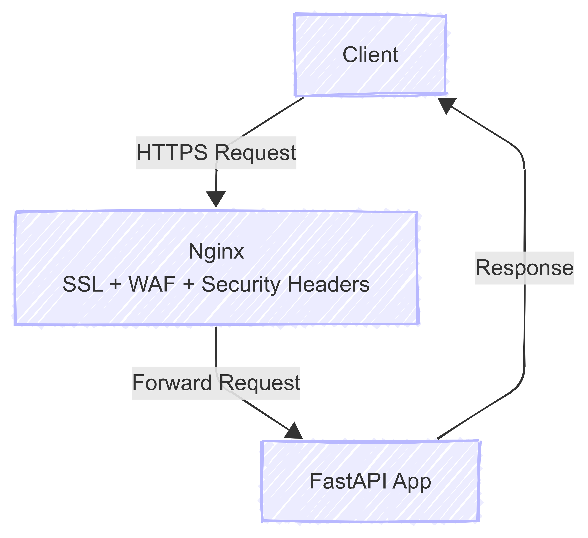

# Secure Nginx Reverse Proxy with SSL/TLS & Security Hardening

This project demonstrates how to deploy a backend application securely using **Nginx** as a reverse proxy with **SSL/TLS automation** and additional **hardening techniques**.

---

## Features
- Reverse proxy setup for backend app (FastAPI demo included)
- Automated SSL/TLS with **Certbot**
- HTTP → HTTPS redirection with **HSTS**
- Strong **security headers** (CSP, X-Frame-Options, Referrer Policy, etc.)
- **Rate limiting** to prevent brute-force/DoS attacks
- Basic **WAF rules** against common exploits
- Automated setup script (`setup.sh`) for reproducibility
- UFW firewall with secure defaults

---

## Tech Stack
- **Nginx** – Reverse proxy & load balancer  
- **Certbot** – SSL/TLS automation with Let’s Encrypt  
- **UFW** – Firewall for server protection  
- **FastAPI (demo app)** – Example backend service  
- **Linux (Ubuntu)** – Deployment environment  

---

## Project Structure

```
secure-nginx-reverse-proxy/
│── nginx/
│ ├── nginx.conf # Main Nginx config
│ ├── sites-available/
│ │ └── app.conf # Reverse proxy + SSL + headers
│ └── snippets/
│ └── security.conf # Security headers + WAF rules
│── scripts/
│ ├── setup.sh # Automates Nginx + Certbot + Firewall
│ └── renew.sh # Forces certificate renewal
│── app/
│ └── main.py # Demo FastAPI backend app
│── docs/
│ ├── architecture.png # Architecture diagram
│ └── screenshots/ # Proof of SSL + headers
│── README.md
```

---

## Quick Setup

1. **Clone repo**
```bash
git clone https://github.com/yourusername/secure-nginx-reverse-proxy.git
cd secure-nginx-reverse-proxy
```
2.  **Make setup script executable**
```bash
chmod +x scripts/setup.sh #make changes to your domain name and email
```
3. **Run setup**
```bash
./scripts/setup.sh
```
4. **Verify SSL**
```bash
curl -I https://yourdomain.com
```

---

## Security Features

- **SSL/TLS automation** → free certificates with auto-renewal  
- **HSTS (HTTP Strict Transport Security)** → enforce HTTPS  
- **Security headers** → protection against clickjacking, MIME sniffing, etc.  
- **Rate limiting** → prevent abuse (10 req/sec per IP)  
- **Basic WAF** → block suspicious queries & PHP exploits  
- **Firewall rules** → allow only SSH & HTTPS traffic  

---

## Architecture
**Flow**:



---

## Value for DevOps

This project demonstrates:

- **Server provisioning & automation**  
- **Web security hardening**  
- **Reverse proxy architecture**  
- **Certificate management**  
- **DevOps portfolio-ready infrastructure**  
